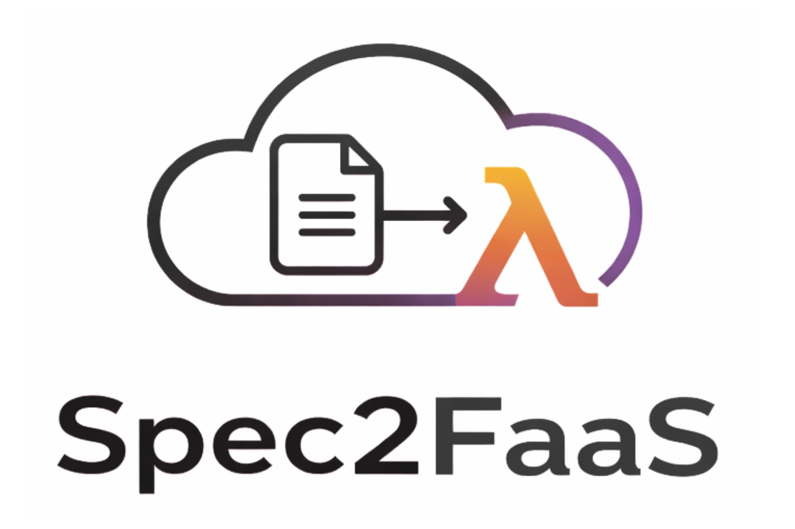

  

## Overview

The **Function-as-a-Service (FaaS)** serverless paradigm is increasingly popular, allowing users to focus on application development while abstracting away operational aspects (e.g., auto-scaling), which are automatically managed by the underlying platform. The advent of Large Language Models (LLMs) capable of code generation raises the question of whether FaaS can be extended further to abstract away the coding effort from users as well. Although recent studies have investigated the use of LLMs for function generation and deployment, they do not provide an end-to-end pipeline spanning from user requirements to function deployment.

To fill this gap, **Spec2FaaS** introduces a novel multi-agent system that autonomously transforms natural language specifications into validated deployments on an open-source FaaS platform. The system decomposes development into specialized agents for code generation, test synthesis, execution, debugging, and deployment, enabling fully automated and self-correcting function development. Evaluated on the HumanEval+ benchmark, Spec2FaaS demonstrates that fully autonomous, end-to-end serverless engineering is both feasible and promising.

---

## Architecture

Spec2FaaS is composed of **seven specialized agents**, each assigned a well-defined role:

- **Assistant Agent** – Analyzes the user request and orchestrates the workflow.  
- **Entry Point Agent** – Determines the function signature and retrieves relevant pseudocode (RAG-based).  
- **Coder Agent** – Generates the function implementation.  
- **Test Designer Agent** – Produces unit tests for validation.  
- **Test Executor Agent** – Executes code and tests inside isolated Docker containers.  
- **Debugger Agent** – Iteratively corrects failing implementations (up to 10 iterations).  
- **FaaS Deployment Agent** – Deploys validated functions on the FaaS platform.

The orchestration layer is implemented with AutoGen Core, enabling structured message passing and autonomous coordination.  
Deployment is handled through Serverledge, an open-source FaaS framework integrated into the agent pipeline.

---

## Key Features

- End-to-end automation: spec → code → tests → debugging → deployment  
- Multi-agent modular design  
- Secure code execution in isolated Docker environments  
- Retrieval-Augmented Generation (RAG) for structured code synthesis  
- Fully autonomous FaaS deployment through a specialized agent

---

## Evaluation

The system is evaluated on the HumanEval+ dataset, which provides natural language descriptions, signatures, reference implementations, and extensive test suites.

### Highlights

- **Coder Agent**: up to **96% pass@1**  
- **Coder + Debugger**: **97.6% overall correctness**  
- **FaaS Deployment Agent**: **92% successful deployments**  
- **Test Designer Agent**: up to **74% pass@1**  

Full pipeline evaluation:

- **148 / 164 functions** successfully executed on FaaS  
- **82 / 164 functions** fully correct end-to-end  

Results show that individual agents achieve performance comparable to or exceeding prior work, while the system effectively demonstrates fully autonomous serverless deployment.

---

## Contribution

Spec2FaaS introduces:

- A unified multi-agent architecture covering the entire software lifecycle  
- Tool-augmented agents with secure execution capabilities  
- Autonomous integration of LLM-based generation with FaaS deployment  
- Empirical evaluation across open-weight and proprietary LLMs using a standard benchmark 
